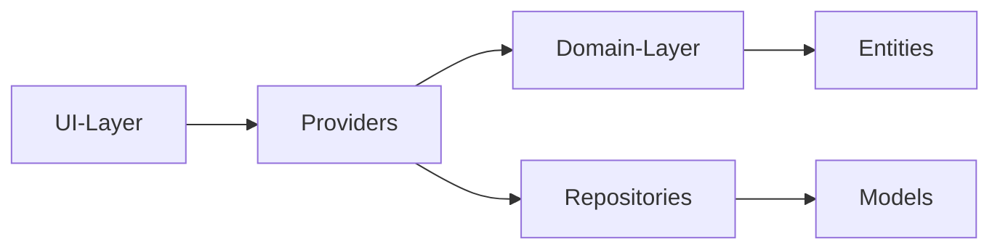

## A Guide to Understand this Project for Beginners

You might find yourself wondering, how does everything work here? It is very helpful to understand this project by reading Flutter documentation about App Architecture [here](https://docs.flutter.dev/app-architecture/guide).

Long story short, most likely you will find inspect the [Presentation (or UI) layer](../lib/ui) first or perhaps the [main.dart](../lib/main.dart) which points toward pages upon pages. After all, it is easier to have something visual to see and then go from there.

You might be trying to learn the structure while running the app to see what it runs, where it currently is, et cetera. This guide will help you shorten the amount of time on understanding how UI is parsed, how data is flow, and what each layer in app architecture is doing in this project.

This guide will take a backward approach of peeling from the UI to the data layer. This guide will also assume general knowledge about Flutter.

### TLDR
```
UI Layer
-> Providers
    -> Domain Layer 
    -> Repositories 
        -> Entities
        -> Models
```


### Structure

### 01. UI Layer

UI layer is responsible for what you see on screen, a template of sort. What you will most likely see in this project UI layer is pages that use [Deferred Components](https://docs.flutter.dev/perf/deferred-components) or [Stac](stac.dev), a Server-Driven UI framework. Both is used to parse UIs from the network, enabling dynamic view without direct changes to the code.

In the UI layer, you will also see something called Providers, a global state management object from the library [Riverpod](riverpod.dev). The UI will use these providers to get data from other layers through series of [Dependency Injection](https://docs.flutter.dev/app-architecture/case-study/dependency-injection). In short, Dependency Injection allows a class to receive dependencies from an external source rather than creating them itself. It is mainly used for highly modular architecture.

To track where data comes from, you likely need to understand how Riverpod work (separately outside of this guide). Riverpod will fetch data for the UI by injecting use cases from domain layer and repositories from the data layer.

Riverpod providers reside in [/lib/core/providers](../lib/core/providers).

### 02. Domain Layer

Domain layer is responsible for business logic. It is the bridge between UI and Data layer. It contains only pure Dart logic, free from any external libraries, except for a code generator like Freezed, json_annotation, and json_serializable. Those three libraries is NOT used as part of the business logic itself, but help for development to reduce boilerplate code and reduce human error when facing equalities in dart.

What you will likely find in here is the use cases, repositories, and entities. Use cases contains what business logic should be used in the UI (for example, filtering, sorting, etc.) Repositories contains contracts, a list of function that should be handled before given to the UI layer. It's mostly a template of what should or should not be included as part of app functionality. Entities is the model of the data that should be received by the UI.

If you inspect the domain layer, you will find what seems to be a lot of redundancy, especially in use cases and entities. In use cases, the current implementation does not do much business logic so half of it is considered a "Pass-Through Use Cases". We do not bypass this to anticipate changing business requirement. Entities might also seem useless but they ensure that UI receive consistent data structure even if data layer were to change.

So to make it short, from the UI layer, you will find providers. From providers, you will find injected use cases from domain layer. If domain layer is just a template, then it needs the data, so provider will also inject repositories from data layer.

Provider is the bridge between all 3 layers.

### 03. Data Layer

This is where the data resides. Databases, datasources, repositories. It should get the data, store the data, and serve the data to the providers. 